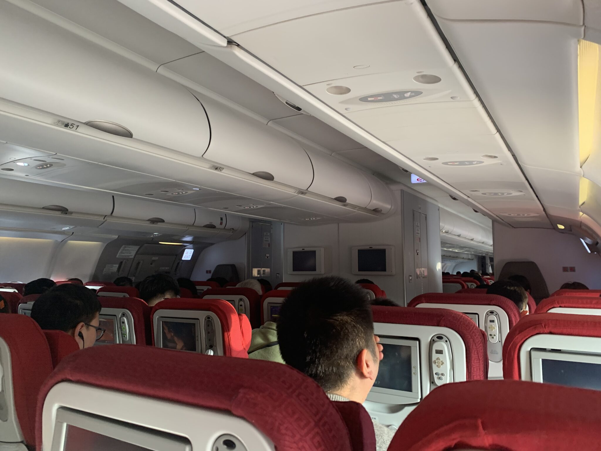
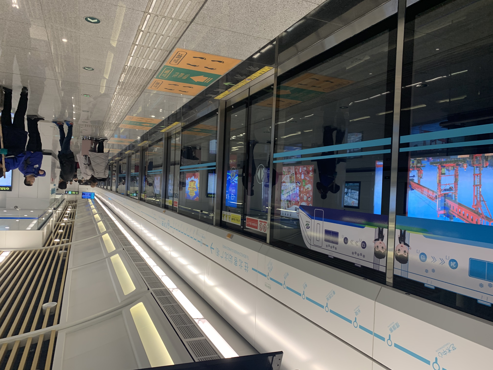
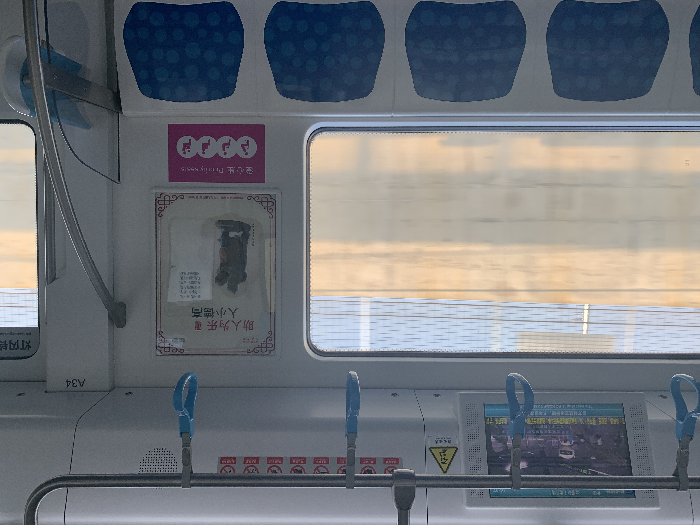
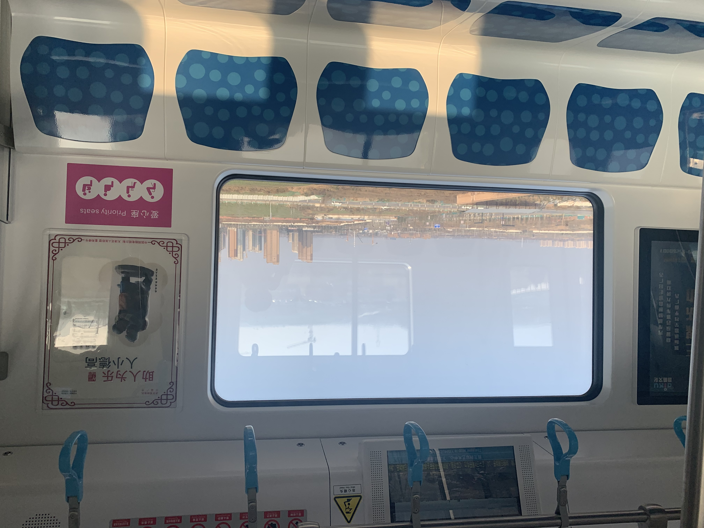
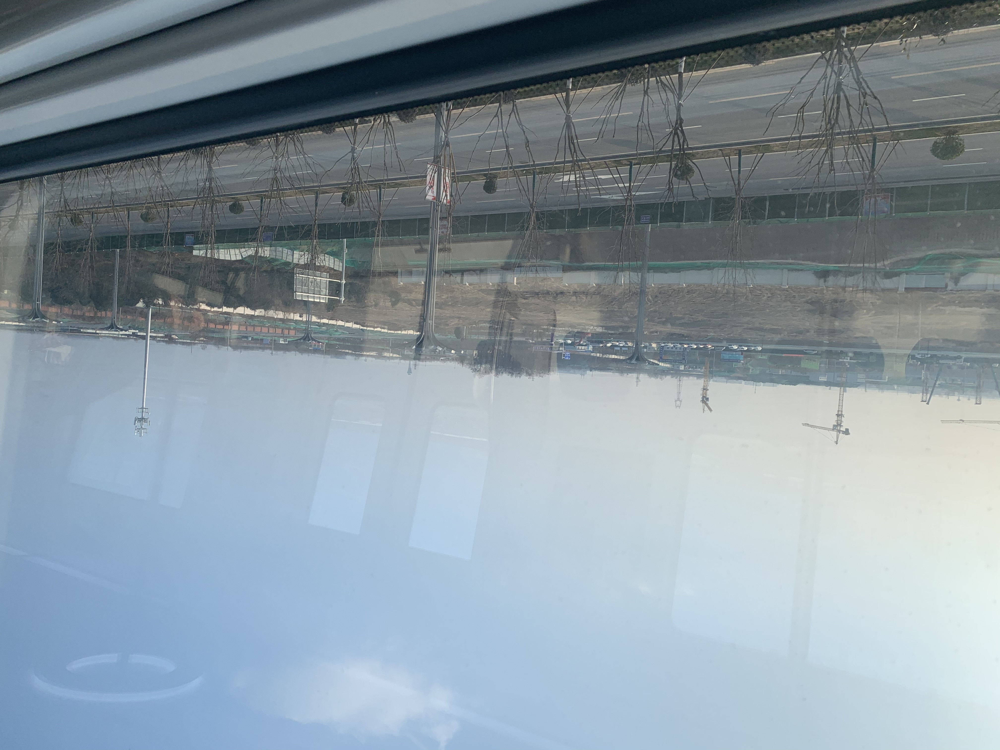
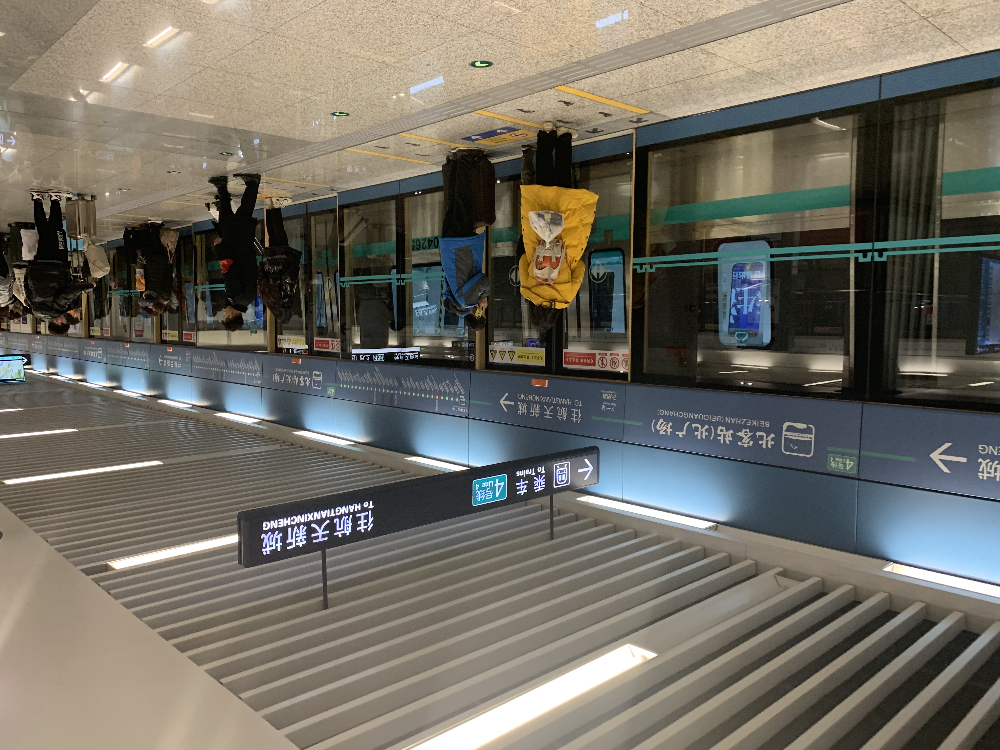
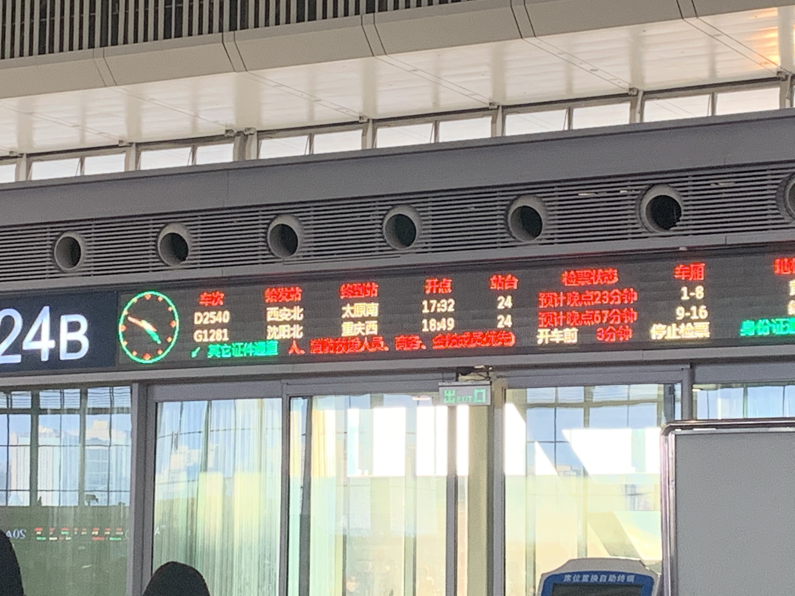

## 概览

**经由：** 中国 陕西 西安

**路线：** 西安咸阳机场 --- 机场城际 --- 西安北站

**历时：** 2 小时

## 出发

由于即将要乘坐海南航空的大飞机从杭州飞西安路过，提前地图上查到西安机场地铁修好了，正好体验一波。于是有了这篇文章。起飞前留影：

<video controls>
    <source src="res/img20.MOV" type="video/mp4">
</video>

飞抵久而未见的西安国际机场

#### 进站

作为 9 月份才开通的新机场地铁，到航站楼的时候还有很多人喊去坐机场大巴，还以为没开通。结果轻轻松松找到了地铁入口

想说说这个 16 块一张的票，幸好备了现金，不然票都没法买。貌似还不支持用银联或者乘车码支付

机场城际地下的装潢风格就很普通了，跟西安城内的不同

#### 上车

横着的座位

还有地铁内显示的时速表，最快开到 80+ km/h，算是很快的地铁了

#### 到站

终点站是西安北站，坐了大概半个小时

西安地铁独特的装潢风格

西安北站

因北方大雪，大部分高铁都晚点，第一次碰见这种情况。

