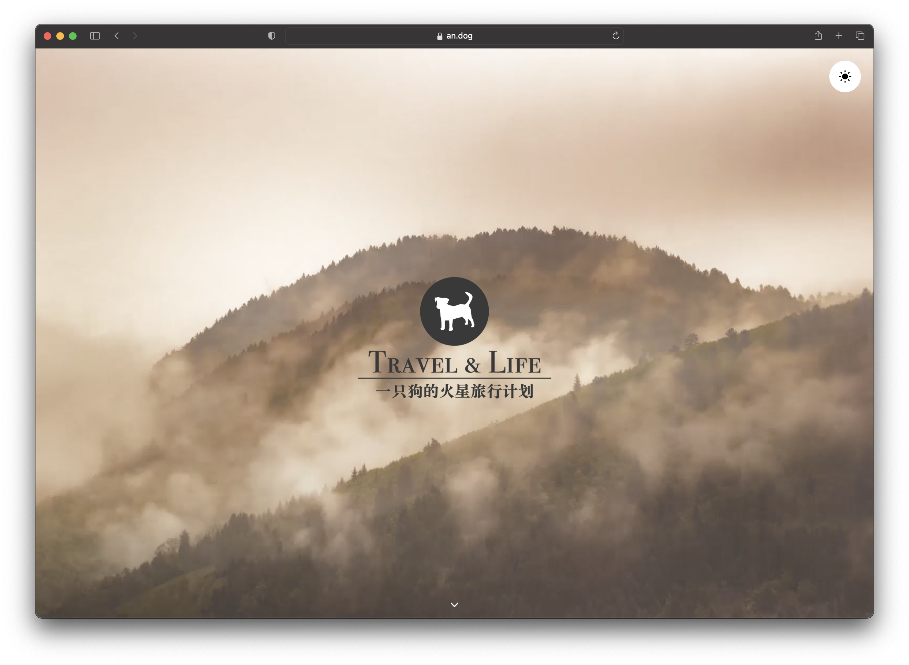
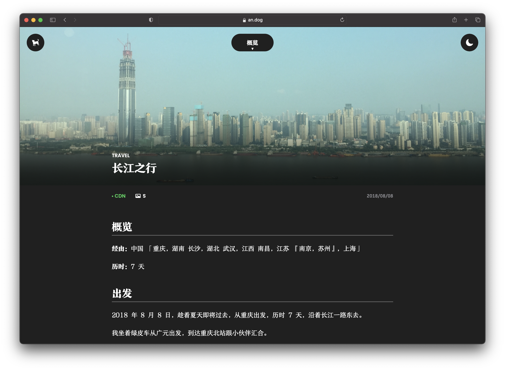

今天，随着第一代新网站的文章内导航索引的最后完工，使得这个历时数周铸建的第一代 blog 网站正式完工。接下来是一篇站内使用说明：

这是网站首页

右上角的月亮图标告诉你，当前是深色模式，你可以点击这个月亮使其变为太阳，即正常模式。

在点进一篇 blog 之后，你可以看见：

左上角的 logo 可以帮助你回到主页，通过点击顶端的标题导航可以帮助你查看到本篇 blog 的主要内容并跳转。标题之下第一行的 "CDN" 是当前开启 CDN 来访问这篇 blog，可以通过点击 "CDN" 来关闭。

访问愉快❤️
